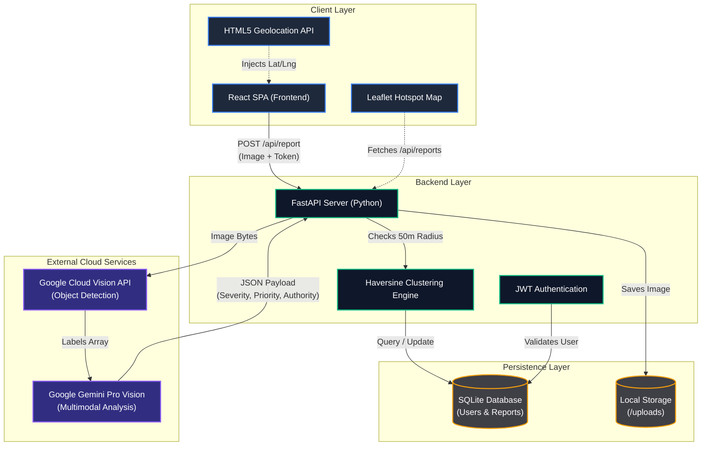
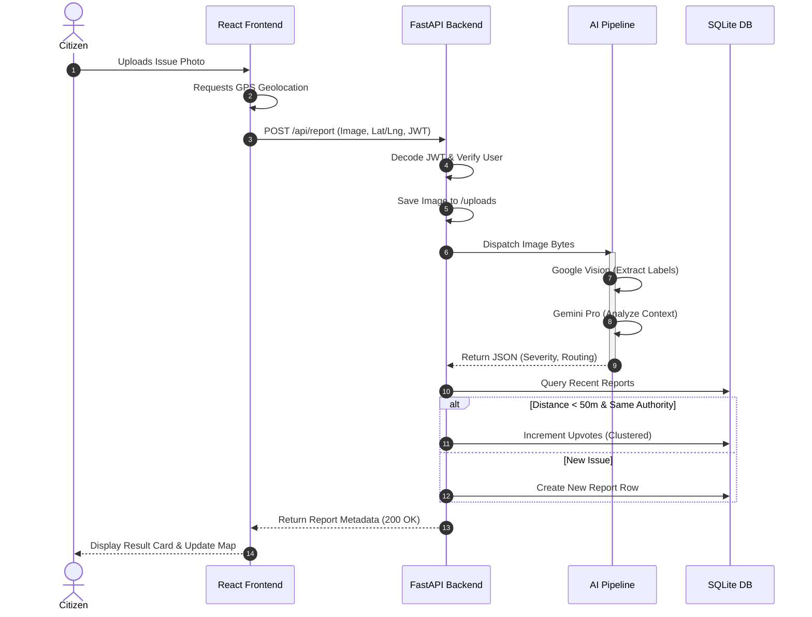
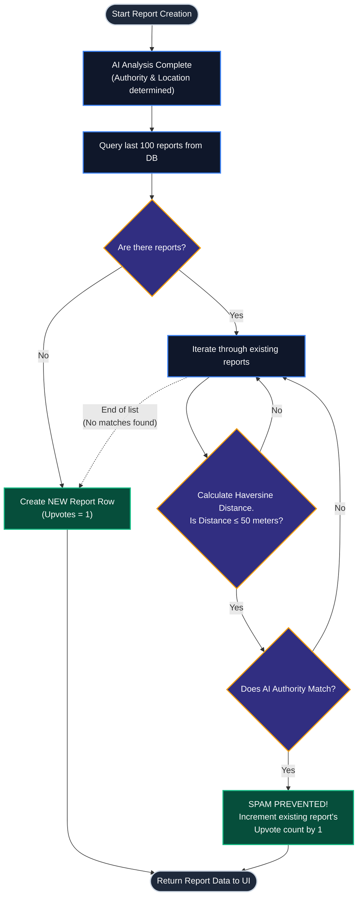
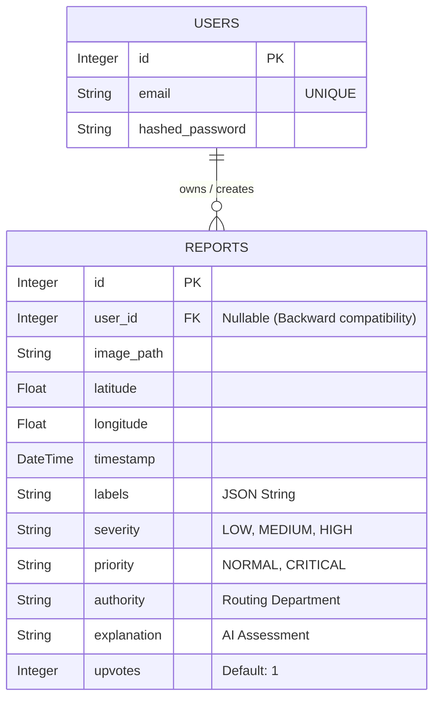

# CivicSense AI: Architectural Diagrams & Flowcharts

The following diagrams illustrate the core workflows and architecture of the CivicSense AI platform. You can use these visual models directly in your project book or presentation.

---

## 1. High-Level System Architecture
This diagram shows the relationship between the client interface, the server logic, the local database, and the external AI cloud services.

---

## 2. Citizen Reporting Workflow
This sequence diagram tracks the lifecycle of a single issue report, from the moment a user uploads a photo to the final dashboard update.

---

## 3. Smart Clustering (Anti-Spam) Decision Tree
This flowchart details exactly how the backend utilizes the Haversine formula to prevent municipal spam.

---

## 4. Entity-Relationship (ER) Diagram
This diagram shows how the SQLite database is structured using SQLAlchemy, particularly highlighting the relationship between registered users and their reported issues.

